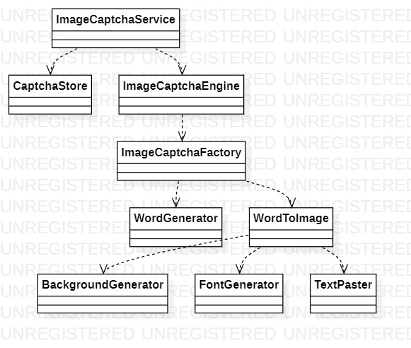

JCaptcha是一款用于生成、校验Captcha的框架，支持文字、声音、图像等3种格式。最后一次发布版本更新是在2009年2月4日，从那之后，整个项目就进入了维护状态。虽然JCaptcha很多年前就断更了，但是考虑到它的扩展性、可靠性、可用性，仍然决定把它推荐给大家。

JCaptcha的架构图如下：



图像是一种最常见的Captcha类型，JCaptcha把图像Captcha封装成了ImageCaptcha类，ImageCaptcha类有challenge和question2个属性，challenge是java.awt.image.BufferedImage类型的图片，也就是用户最终看到的，如果要生成challenge，就得从ImageCaptchaService入手。

ImageCaptchaService类负责生成、存储challenge图片，并校验用户输入。challenge图片默认可以存到HashMap、Ehcache等等，如果想要存到Redis、MySQL等等数据库中，就要自行扩展CaptchaStore接口。

ImageCaptchaService的构造器传入一个ImageCaptchaEngine对象，生成challenge图片的工作最终会落实到它的身上。ImageCaptchaEngine类配置了一组ImageCaptchaFactory，每个ImageCaptchaFactory专门负责生成一种样式的challenge图片，ImageCaptchaEngine随机调用一个ImageCaptchaFactory生成一个随机的challenge图片。

ImageCaptchaFactory负责完成2项任务，一项是生成随机数，可以读取文件，或者指定字符串，另一项是确实如何根据随机数绘制对应的challenge图片，也就是使用BackgroundGenerator、FontGenerator、TextPaster来确定challenge图片的背景、字体、样式。

下面用一个例子给大家讲解JCaptcha的用法。

1. 引入Maven包：

   ```
   <dependency>
       <groupId>com.octo.captcha</groupId>
       <artifactId>jcaptcha-all</artifactId>
       <version>1.0-RC6</version>
       <exclusions>
           <exclusion>
               <groupId>org.springframework</groupId>
               <artifactId>spring</artifactId>
           </exclusion>
           <exclusion>
               <groupId>xerces</groupId>
               <artifactId>xercesImpl</artifactId>
           </exclusion>
           <exclusion>
               <groupId>xerces</groupId>
               <artifactId>xmlParserAPIs</artifactId>
           </exclusion>
       </exclusions>
   </dependency>
   ```

   > `com.octo.captcha:jcaptcha:1.0`无法使用，原因是找不到传递的依赖`com.jhlabs:imaging:01012005`，可能是被作者删除了。
   >
   > 
   >
   > 如果已经用了Spring、MyBatis，就必须排除org.springframework:spring、xerces:xercesImpl和xerces:xmlParserAPIs，否则会产生冲突。

2. 自定义ImageCaptchaService，生成一张challenge图片，并输出到客户端：

   ```
   public class CaptchaService {
       private static ImageCaptchaService instance = new DefaultManageableImageCaptchaService(
               new FastHashMapCaptchaStore(),
               new NonLinearTextGimpyEngine(),
               180,
               100000,
               75000
       );
   
       private CaptchaService() {
       }
   
       public static ImageCaptchaService getInstance() {
           return instance;
       }
   }
   ```
   ```
   response.setHeader("Cache-Control", "no-store");
   response.setHeader("Pragma", "no-cache");
   response.setDateHeader("Expires", 0);
   response.setContentType("image/jpeg");
   
   OutputStream out = null;
   String captchaId = request.getSession().getId();
   try {
       BufferedImage image = CaptchaService.getInstance().getImageChallengeForID(captchaId);
       out = response.getOutputStream();
       ImageIO.write(image, "jpeg", out);
       out.flush();
   } catch (CaptchaServiceException e) {
   	e.printStackTrace();
   } catch (IOException e) {
   	e.printStackTrace();
   } finally {
       if (out != null) {
       	try {
       		out.close();
       	} catch (IOException e) {
       		e.printStackTrace();
       	}
       }
   }
   ```
   
3. 校验用户输入：

   ```
   String captcha = request.getParameter("captcha");
   String captchaId = request.getSession().getId();
   try {
       isValid = CaptchaService.getInstance().validateResponseForID(captchaId, captcha);
   } catch (CaptchaServiceException e) {
       e.printStackTrace();
   }
   ```

   > 注意：区分字符的大小写！！！
