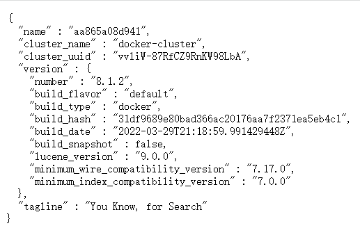

| ELK           | EFK           |
| ------------- | ------------- |
| Elasticsearch | Elasticsearch |
| Logstash      | Fluentd       |
| Kibana        | Kibana        |

EFK和ELK的区别是：把Logstash换成了Fluentd。Logstash是用Java开发的，Fluentd是用C和Ruby开发的，相比于Logstash，Fluentd消耗更少的硬件资源。

**推荐使用Docker搭建EFK技术栈**，安装步骤如下：

1. 配置Fluentd

   ```
   <source>
     @type forward
     port 24224
     bind 0.0.0.0
   </source>
   
   <match **>
     @type elasticsearch
     host elasticsearch
     port 9200
     user elastic
     password 123456
     scheme https
     ssl_verify false
     logstash_format true
     <buffer>
       flush_interval 5s
     </buffer>
   </match>
   ```

   > 参数说明：
   >
   > 1. `scheme https`：Elasticsearch启用了HTTPS，如果不配置这个参数，就会报错：`received plaintext http traffic on an https channel, closing connection Netty4HttpChannel`。
   > 2. `ssl_verify false`：因为Elasticsearch使用了自定义的SSL证书，所以要么提供该SSL证书，要么不检验SSL证书，否则会报错：`Could not communicate to Elasticsearch, resetting connection and trying again. SSL_connect returned=1 errno=0 state=error: certificate verify failed (self signed certific`
   >    `ate in certificate chain) (OpenSSL::SSL::SSLError) Unable to verify certificate`。
   > 3. `user elastic`和`password 123456`：连接Elasticsearch的时候需要提供账号、密码，否则会报错：`Could not communicate to Elasticsearch, resetting connection and trying again. [401] {"error":{"root_cause":[{"type":"security_exception","reason":"missing authentication credentials for REST request [/]"`。

2. 自定义Fluentd镜像

   **Fluentd最新的镜像没有预装Elasticsearch Output插件**，需要自行安装，Dockerfile如下：

   ```
   FROM fluent/fluentd:v1.14.5-debian-1.0
   USER root
   RUN ["gem", "install", "fluent-plugin-elasticsearch", "--no-document", "--version", "5.2.1"]
   USER fluent
   ```

3. 编写docker-compose.yml

   ```
   version: "3"
   services:
     elasticsearch:
       image: docker.elastic.co/elasticsearch/elasticsearch:8.1.2
       container_name: elasticsearch
       environment:
         - "discovery.type=single-node"
       expose:
         - "9200"
         - "9300"
       ports:
         - "9200:9200"
         - "9300:9300"
   
     fluentd:
       build:
         context: ./fluentd
       container_name: fluentd
       volumes:
         - ./fluentd/conf:/fluentd/etc
       links:
         - "elasticsearch"
       ports:
         - "24224:24224"
         - "24224:24224/udp"
       depends_on:
         - elasticsearch
   
     kibana:
       image: docker.elastic.co/kibana/kibana:8.1.2
       container_name: kibana
       links:
         - "elasticsearch"
       ports:
         - "5601:5601"
       depends_on:
         - elasticsearch
   ```

   > 参数说明：
   >
   > 在配置`links`之后，Fluentd、Kibana容器内部可以使用域名`elasticsearch`来连接Elasticsearch；
   >
   > 当然，Kibana也可以选择配置环境变量`ELASTICSEARCH_HOSTS`来连接Elasticsearch，如：`ELASTICSEARCH_HOSTS: '["https://localhost:9200"]'`；

4. 运行`docker-compose up -d`命令部署容器；

5. 重置用户`elastic`的密码

   不要再从Elasticsearch容器输出的日志中找初始密码了，太考验眼力了，直接运行`docker container exec -it [容器ID] /usr/share/elasticsearch/bin/elasticsearch-reset-password -u elastic`命令重置`elastic`的密码。

6. 访问https://localhost:9200确认Elasticsearch是否安装成功，若一切正常，则出现类似如下截图：

   

7. 配置Kibana

   首先，访问http://10.23.18.160:5601;

   然后，输入Enrollment token，运行`docker container exec -it [Elasticsearch容器ID] /usr/share/elasticsearch/bin/elasticsearch-create-enrollment-token --scope kibana`命令即可获得；

   接下来，输入验证码，运行`docker container exec -it [Kibana容器ID] /usr/share/kibana/bin/kibana-verification-code`命令即可获得，验证码是6位数字。

   以上2个步骤，Kibana界面都有提示，一步一步照着提示操作即可。

   最后，确认Kibana是否安装成功。

   > 温馨提示：
   >
   > 也可以在Kibana中修改`elastic`的密码，步骤5重置的密码是一串随机的字符，不容易记忆。
