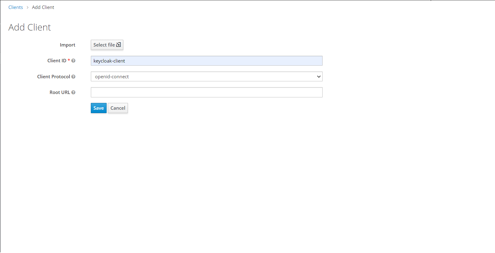
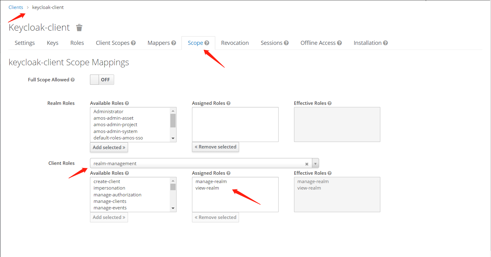
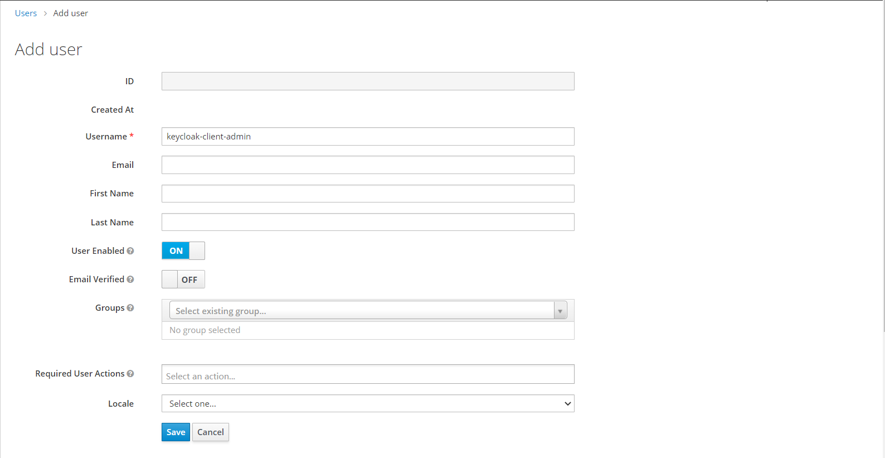
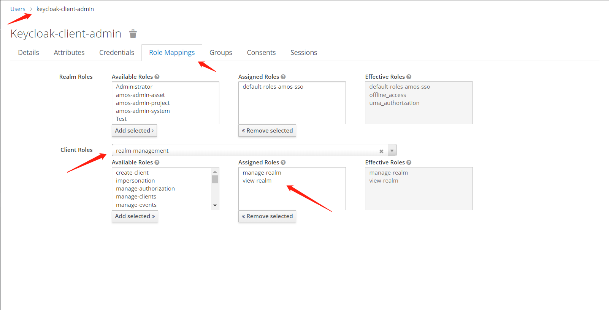

Keycloak自带了一套Admin REST API用来实现Admin Console的大部分功能，比如：获取token、新增Realm、用户管理等等。

通过CURL就能调用。

此外，为了方便Java开发者使用，还提供了一套Java API，引入方式如下：

```
<dependency>
  <groupId>org.keycloak</groupId>
  <artifactId>keycloak-admin-client</artifactId>
  <version>${keycloak-version}</version>
</dependency>
```

下面就使用Keycloak Java API来实现角色管理。步骤如下：

1. 创建Client（`keycloak-client`）和User（`keycloak-client-admin`）并分配权限；

   1. 创建Client并分配权限；

      

      

   2. 创建User并分配权限；

      

      

2. 配置Keycloak实例；

   ```
   @Configuration
   public class KeycloakClientConfig {
       @Bean
       public Keycloak keycloak() {
           return KeycloakBuilder.builder()
                   .serverUrl(KEYCLOAK_URL)
                   .realm(KEYCLOAK_REALM)
                   .clientId("keycloak-client")
                   .clientSecret("")
                   .username("keycloak-client-admin")
                   .password("123456")
                   .build();
       }
   }
   ```

3. 使用与角色相关的API；

   1. 根据角色名称，分页查询角色；

      ```
      @Service
      public class RoleService extends CrudService<RoleRepresentation> {
          @Value("${keycloak.realm}")
          private String keycloakRealm;
      
          @Autowired
          private Keycloak keycloak;
      
      	...
      	
          @Override
          public Map<String, Object> search(Pageable<RoleRepresentation> pageable) {
              Map<String, Object> data = new HashMap<>();
      
              String roleName = pageable.getConditions().getName();
              Integer total = keycloak.realm(keycloakRealm)
              						.roles()
              						.list(roleName, true)
              						.size();
              if (total > 0) {
                  List<RoleRepresentation> representations = keycloak.realm(keycloakRealm)
                  						.roles()
                  						.list(roleName, pageable.getOffset(), pageable.getLimit(), true);
                  data.put("total", total);
                  data.put("items", representations);
              } else {
                  data.put("total", 0);
                  data.put("items", null);
              }
              return data;
          }
          
          ...
          
      }
      ```

      **与角色相关的查询API**的返回结果封装成了`org.keycloak.representations.idm.RoleRepresentation`对象。**增删改**也是操作`RoleRepresentation`对象。

   2. 新增角色；

      ```
      public void add(RoleRepresentation representation) {
      	keycloak.realm(keycloakRealm).roles().create(representation);
      }
      ```

   3. 修改角色；

      ```
      public void update(RoleRepresentation representation) {
          keycloak.realm(keycloakRealm).rolesById().updateRole(representation.getId(), representation);
      }
      ```

   4. 删除角色；

      ```
      public void remove(String id) {
      	keycloak.realm(keycloakRealm).rolesById().deleteRole(id);
      }
      ```

与用户相关的API和角色的用法差不多，不再详述。
