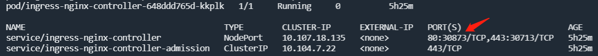

在[微服务架构升级一](https://warnier-zhang.github.io/Upgrading-Microservices-Architecture-Part-1-Config/)中，我们改造了配置中心。现在，我们开始动手改造API网关——使用**Kubernetes Ingress**替换**Spring Cloud Gateway**。

Kubernetes Ingress不单单指Ingress，实际上，包括Ingress和Ingress Controller两部分，前者相当于<u>Nginx配置文件</u>，后者相当于<u>Nginx应用程序</u>，需要配合起来一起使用才行。核心概念如下：

- Ingress

  

  Ingress是一种类似Deployment、Pod、Service的API资源对象，作用范围是在命名空间内，用来定义外部客户端访问集群内Service的路由规则，具体是根据域名、URL等等，把外部客户端的HTTP(S)请求转发到对应的集群内Service。

- Ingress Controller

  Ingress控制器，是Ingress API的实现，作用范围是在整个集群内，如果使用默认的Kubernetes Ingress Controller，就是在Kubernetes集群中运行一个Nginx Pod。常见的Ingress控制器有Nginx（Kubernetes官方提供）、Istio、HAProxy、Nginx商业版、Kong、Traefik等等。

- IngressClass

  在一个集群中能部署多种Ingress Controller，每种Ingress Controller的配置都不尽相同，相应地，Ingress的配置参数也是多种多样的。需要使用IngressClass把Ingress和Ingress Controller关联起来。

下面以**NodePort版的Ingress Nginx**为例：

1. 部署Ingress Nginx Controller：

   ```
   kubectl apply -f https://raw.githubusercontent.com/kubernetes/ingress-nginx/controller-vX.X.X/deploy/static/provider/baremetal/deploy.yaml
   ```

   版本号自行确定。

   默认的命名空间是`ingress-nginx`，如果需要自定义命名空间，就先下载deploy.yaml，然后重命名命名空间。

2. 部署Ingress对象：

   首先，编写`api-gateway.yml`文件：

   ```
   apiVersion: networking.k8s.io/v1
   kind: Ingress
   metadata:
     name: api-gateway
     namespace: XXX
     annotations:
       nginx.ingress.kubernetes.io/rewrite-target: /$2
   spec:
     ingressClassName: nginx
     rules:
     - http:
         paths:
         - path: /a-service(/|$)(.*)
           pathType: Prefix
           backend:
             service:
               name: a-service-svc
               port:
                 number: 8080
         - path: /b-service(/|$)(.*)
           pathType: Prefix
           backend:
             service:
               name: b-service-svc
               port:
                 number: 8080
   ```

   参数说明：

   - ingressClassName：用来配置IngressClass；
   - path：访问路径，包含正则表达式的URL；
   - pathType：URL匹配方式，主要有`Prefix`（前缀匹配）和`Exact`（精确匹配）；
   - backend：后端，分成`backend.resource`和`backend.service`两种，前者对应Kubernetes资源，后者对应Kubernetes服务。若后端是Kubernetes服务，则：
     - backend.service.name：服务名称；
     - backend.service.port.name：服务端口名称；
     - backend.service.port.number：服务端口数值；
   - annotations：适用于各种Ingress Controller专有的配置参数，例如`nginx.ingress.kubernetes.io/rewrite-target`，即Nginx的URL重写，本文实现类似Spring Cloud Gateway过滤器`StripPrefix=1`的效果；

   然后，执行：

   ```
   kubectl apply -f api-gateway.yml
   ```

   > 若出现`Internal error occurred: failed calling webhook "validate.nginx.ingress.kubernetes.io": Post "https://ingress-nginx-controller-admission.ingress-nginx.svc:443/networking/v1/ingresses?timeout=10s": Bad Gateway`错误，则执行如下命令：
   >
   > ```
   > kubectl delete -A ValidatingWebhookConfiguration ingress-nginx-admission
   > ```

3. 测试访问集群内的Service：

   首先，使用`kubectl`命令查看`ingress-nginx-controller`服务的NodePort端口，结果如下：

   

   然后，打开浏览器访问http://XXX:30873/a-service/hello-world即可。

   
