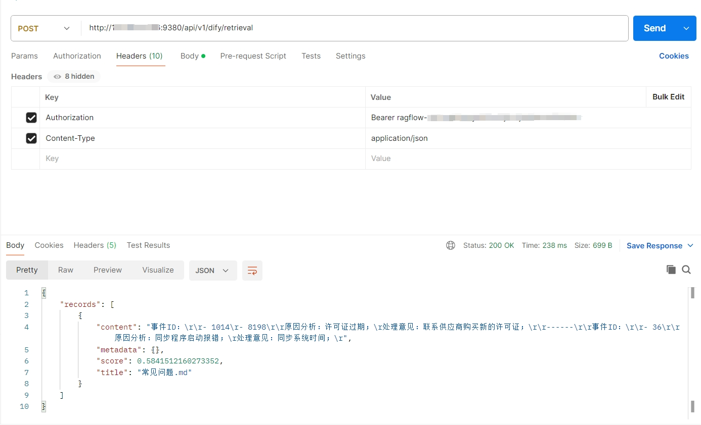
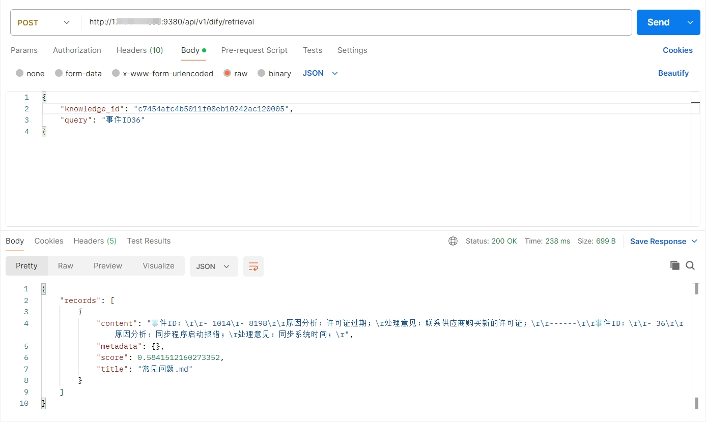
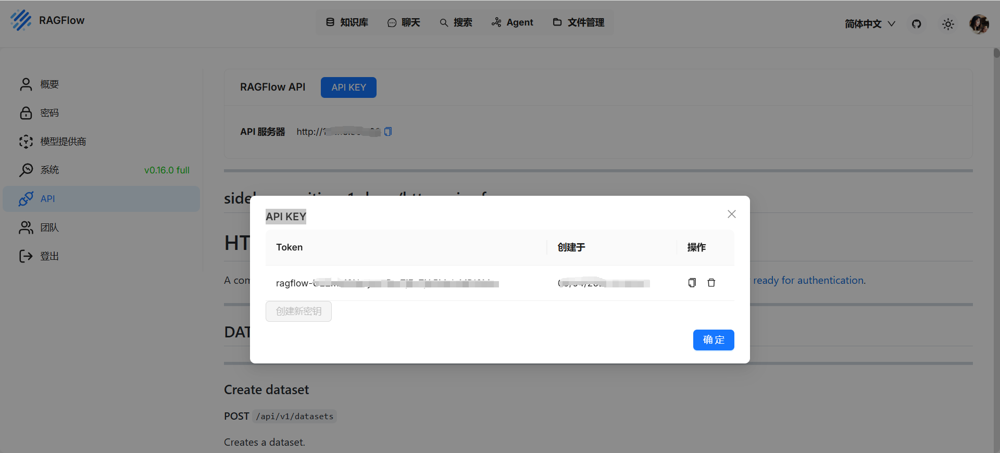
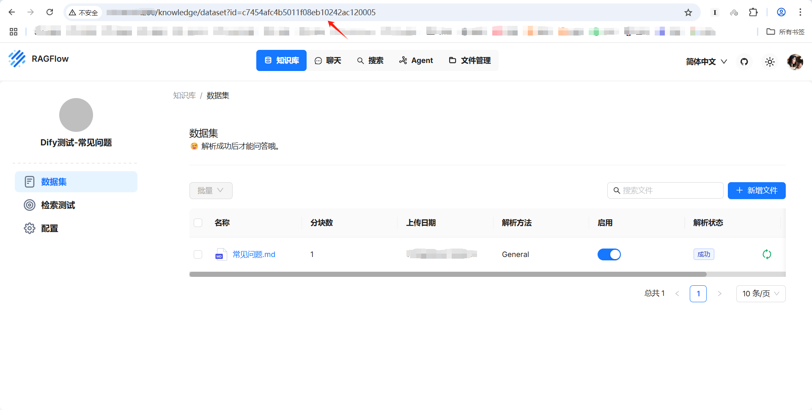
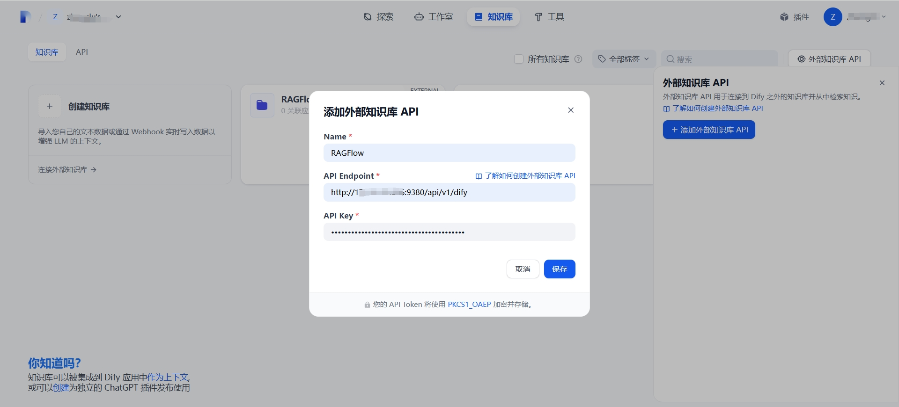
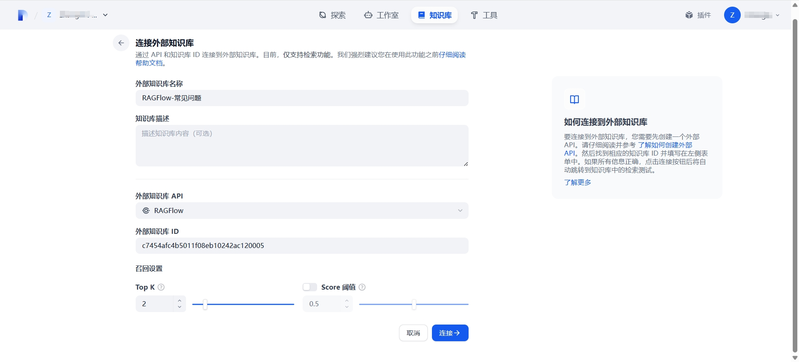
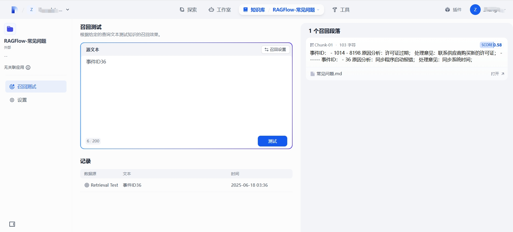

除了**自带**的知识库功能，**Dify**还支持集成**其他系统**的知识库作为**外部知识库**。当然，**前提是**该系统实现了**Dify**的**外部知识库API**。以**RAGFlow**为例。

#### RAGFlow

从版本**<u>v0.13.0</u>**起，**RAGFlow**开始支持**Dify**的**外部知识库API**，API地址为`/api/v1/dify/retrieval`，默认端口是`9380`。

可以通过Postman来测试该API是否运行正常，如下图：





参数说明：

- 请求头`Token`，即**API KEY**，可以在**个人中心 / API**功能中创建：

  

- 请求参数`knowledge_id`，即**知识库ID**，可以在知识库详情页面中，通过浏览器地址栏查看：

  

  > 注意：
  >
  > API KEY和知识库的**<u>创建人</u>**必须一致！！！否则调用API会返回如下错误：
  >
  > ```
  > {
  >     "code": 404,
  >     "message": "Knowledgebase not found!"
  > }
  > ```

- 参数`query`，即在检索测试中输入的关键字；

如果出现上述截图中的API返回结果，就说明该API运行正常。接下来，可以尝试在Dify中配置连接RAGFlow。

#### Dify

首先，进入**知识库**功能模块，然后，按照如下步骤集成RAGFlow作为外部知识库：

1. 添加外部知识库API：

   

   参数说明：

   - API Endpoint：即上述API地址，但是需要去掉`/retrieval`部分；
   - API Key：即上述在RAGFlow的**个人中心 / API**功能中创建的**API KEY**；

2. 连接外部知识库：

   

   参数说明：

   - 外部知识库API：选择**步骤1**添加的`RAGFlow`；
   - 外部知识库ID：即上述在知识库详情页面中看到的`c7454afc4b5011f08eb10242ac1200051`；

3. 召回测试：

   

   若出现类似右侧的召回段落，则成功集成RAGFlow知识库！！！
