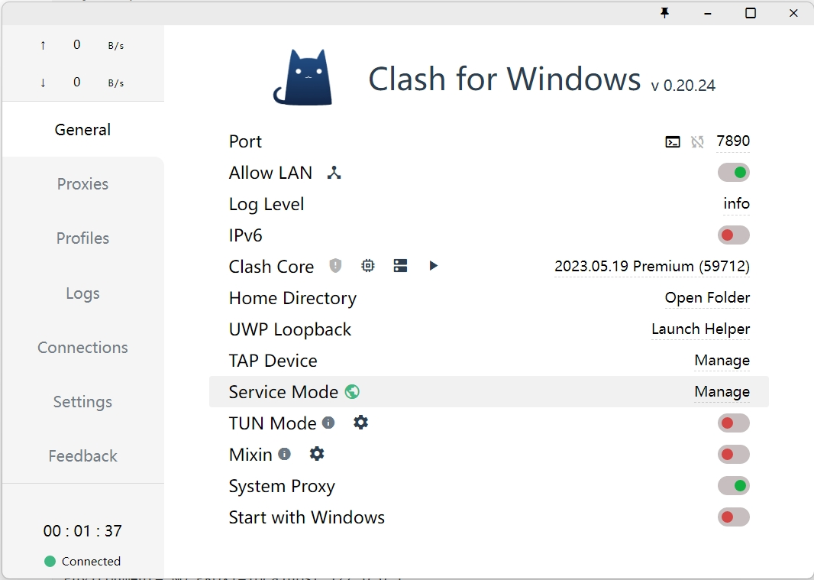

如果**内网**的远程Linux**服务器**需要**<u>临时</u>**访问外网，除了配置公网IP之外，还可以通过把**本地**的、能够访问外网的**Windows主机**作为**代理服务器**来达到目的。

#### 配置本地Windows主机

常用的Windows代理服务器软件有[CCProxy](https://www.youngzsoft.net/ccproxy/)、[WinGate](https://www.wingate.com/)、[3proxy](https://github.com/3proxy/3proxy)、[Squid for Windows](https://github.com/diladele/squid-windows)等等。当前Windows PC上安装的**Clash for Windows**也能实现类似的效果。

打开**Clash for Windows**，在**General**界面中，启用**Allow LAN**和**System Proxy** 2个选项：



> 注意：Allow LAN是允许局域网连接，否则，只能允许本机访问。

#### 配置远程Linux服务器

假设本地Windows主机的IP地址为`192.168.1.1`。

##### 配置Terminal代理

首先，编辑`.bashrc`文件，并新增如下内容：

```
export https_proxy=http://192.168.1.1:7890;export http_proxy=http://192.168.1.1:7890;export all_proxy=socks5://192.168.1.1:7890;export no_proxy=127.0.0.1,localhost
```

然后，执行`source .bashrc`刷新配置。可以通过`curl www.baidu.com`来测试能否访问外网。

##### 配置Docker代理

首先，按如下内容编辑`/etc/systemd/system/docker.service.d/proxy.conf`文件，**该文件如果不存在，请自行创建**：

```
[Service]
Environment="HTTP_PROXY=http://192.168.1.1:7890"
Environment="HTTPS_PROXY=http://192.168.1.1:7890"
Environment="NO_PROXY=localhost,127.0.0.1"
```

然后，执行如下命令重启Docker：

```
systemctl daemon-reload
systemctl restart docker
```

